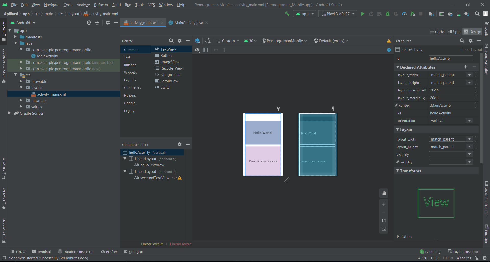

# 01 - Linear Layout

## Tujuan Pembelajaran
Mahasiswa akan membuat halaman login sederhana menggunakan LinearLayout.
Pertama kita belajar membuat hello-world dengan TextView pada Linear Layout.

## Hasil Praktikum

Berikut ini adalah hasil dari praktikum 1

[contoh link](.../.../src\01_linear_layout_hello_world\app\src\main\res\layout)