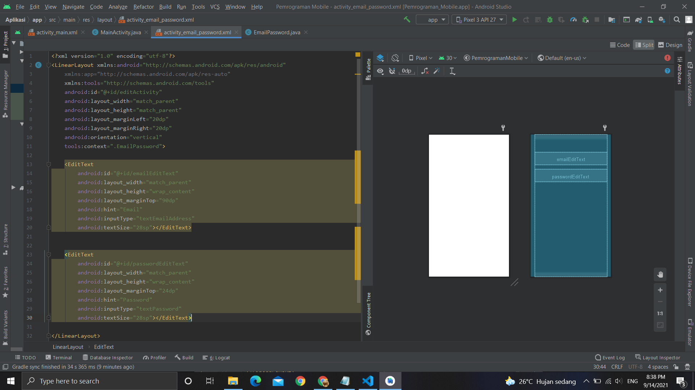

# 02 - Linear Layout - Email & Password

## Tujuan Pembelajaran

Mahasiswa mengetahui cara membuat komponen yang dapat menerima
masukan dari pengguna dengan menggunakan EditText. Ini adalah dasar
untuk membuat halaman yang membutuhkan masukan dari pengguna, seperti
halaman login.

## Hasil Praktikum

Berikut ini adalah hasil dari praktikum 1

[contoh link](src\01_linear_layout_hello_world\app\src\main\res\layout\activity_main.xml)
