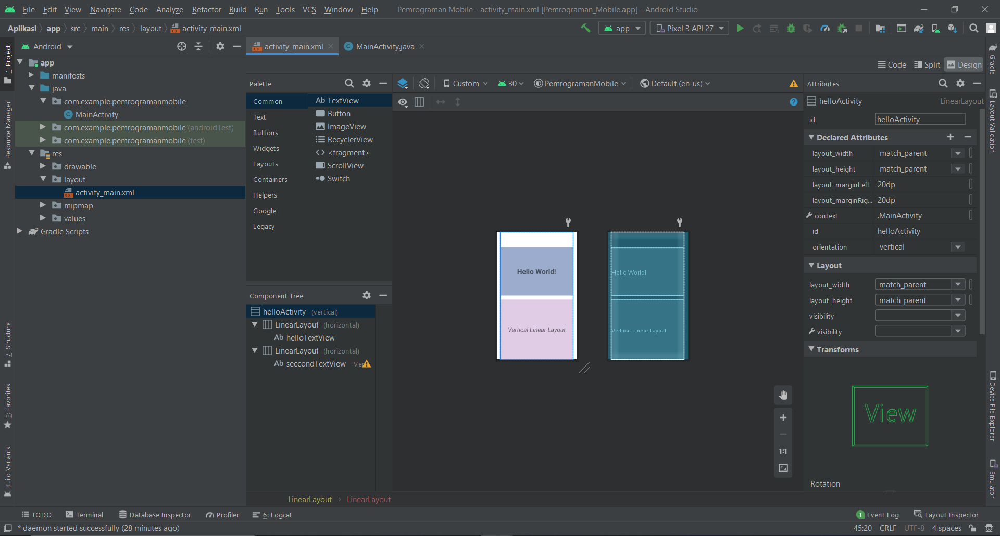

# 01 - Linear Layout

## Tujuan Pembelajaran
Mahasiswa akan membuat halaman login sederhana menggunakan LinearLayout.
Pertama kita belajar membuat hello-world dengan TextView pada Linear Layout.

## Hasil Praktikum

Berikut ini adalah hasil dari praktikum 1

[source code](../../src/02_layout&activity/app/src/main/res/layout/activity_main.xml)