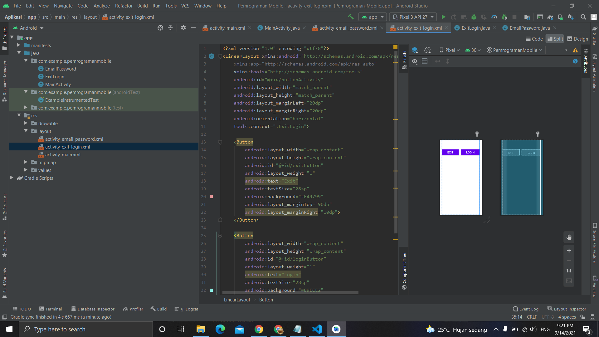

# 03 - Linear Layout - Exit & Login Button

## Tujuan Pembelajaran

Mahasiswa akan belajar bagaimana cara membuat tombol sederhana untuk
aksi pengguna. Tombol exit untuk keluar dari halaman dan tombol login untuk
melakukan login. Mari kita coba menggunakan horizontal linear layout.

## Hasil Praktikum

Berikut ini adalah hasil dari praktikum 3

[source code](../../src/02_layout&activity\app\src\main\res\layout/activity_exit_login.xml)
