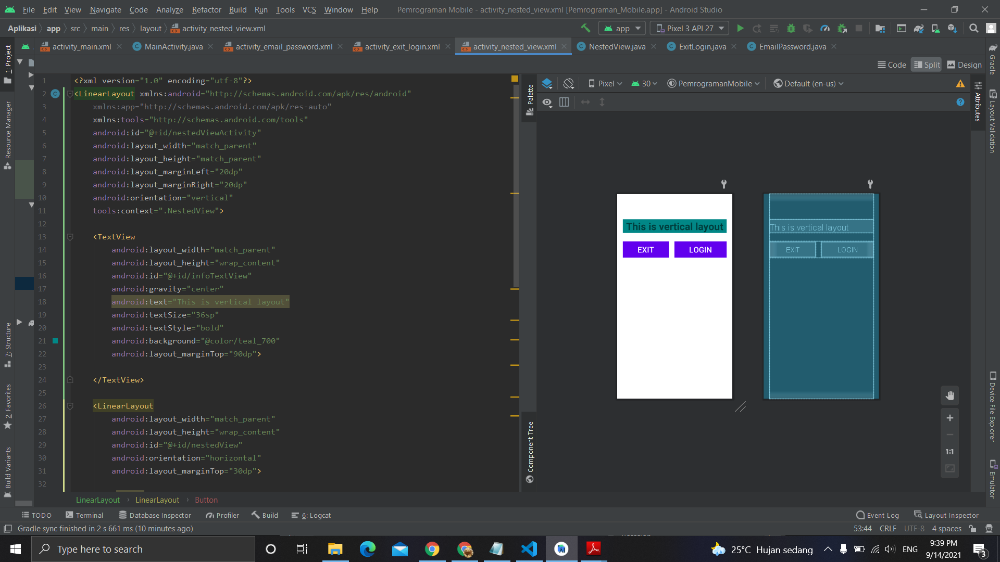

# 04 - Linear Layout - Nested View

## Tujuan Pembelajaran
Mahasisiwa mampu membuat komponen bersarang, horizontal linear layout
pada vertikal linear layout.

## Hasil Praktikum

Berikut ini adalah hasil dari praktikum 4

[source code](../../src/02_layout&activity\app\src\main\res\layout/activity_nested_view.xml)