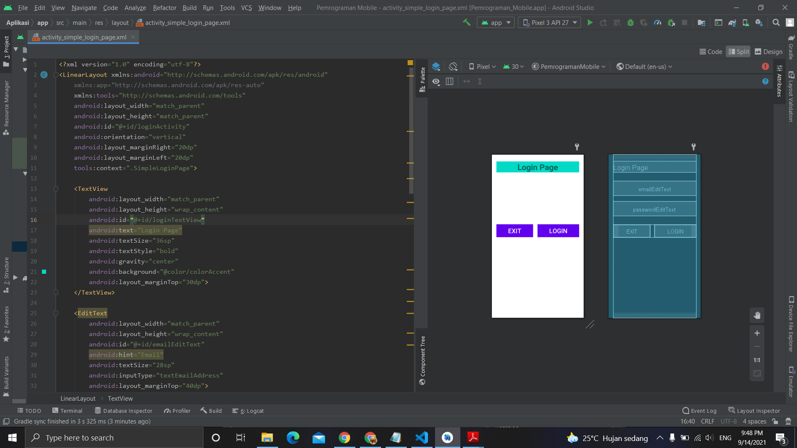

# 05 - Simple Login Page

## Tujuan Pembelajaran
Siswa akan membuat halaman login sederhana berdasarkan materi yang
telah dipelajari sebelumnya. Dalam topik terakhir tentang linear layout ini,
akan terlihat jelas apa yang telah kita pelajari.

## Hasil Praktikum

Berikut ini adalah hasil dari praktikum 5

[source code](../../src/02_layout&activity\app\src\main\res\layout/activity_simple_login_page.xml)