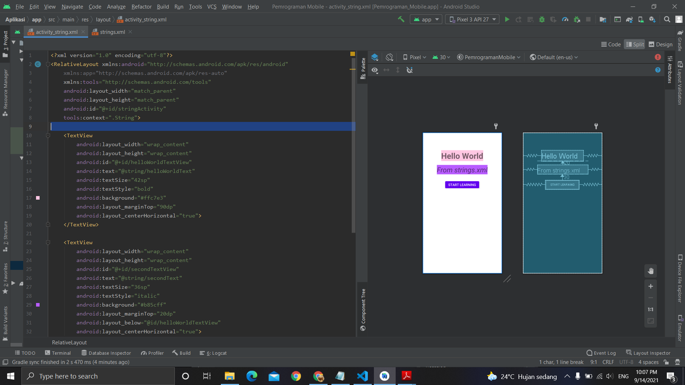

# 06 - String.xml

## Tujuan Pembelajaran
Mahasiswa mengetahui bagaimana cara menggunakan sumber daya string
untuk teks sebuah komponen.

## Hasil Praktikum

Berikut ini adalah hasil dari praktikum 6

[source code](../../src/02_layout&activity/app/src/main/res/layout/activity_string.xml)