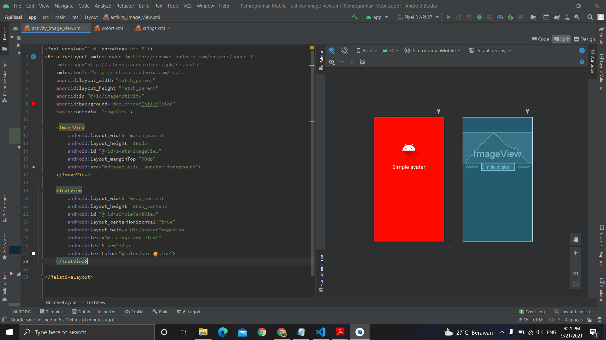

# 08 - Image View

## Tujuan Pembelajaran
Mahasiswa mengetahui cara menampilkan gambar menggunakan imageview.

## Hasil Praktikum

Berikut ini adalah hasil dari praktikum 8

[source code](../../src/02_layout&activity/app/src/main/res/layout/activity_image_view.xml)