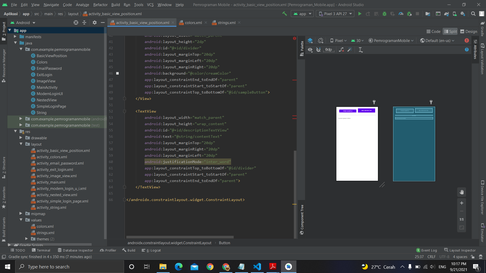

# 10 - Basic View Position

## Tujuan Pembelajaran
Mahasiswa tahu bagaimana mengatur view dalam constraint layout.

## Hasil Praktikum

Berikut ini adalah hasil dari praktikum 10

[source code](../../src/02_layout&activity/app/src/main/res/layout/activity_basic_view_position.xml)