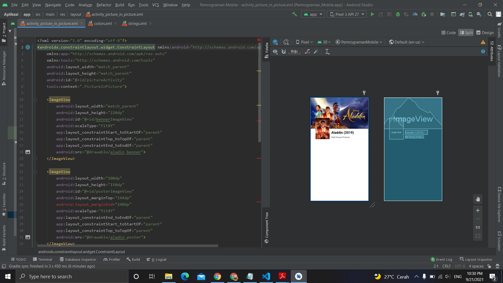

# 11 - Picture in Picture

## Tujuan Pembelajaran
Mahasiswa tahu bagaimana menampilkan gambar dari image resources
menggunakan imageview .

## Hasil Praktikum

Berikut ini adalah hasil dari praktikum 11

[source code](../../src/02_layout&activity/app/src/main/res/layout/activity_picture_in_picture.xml)