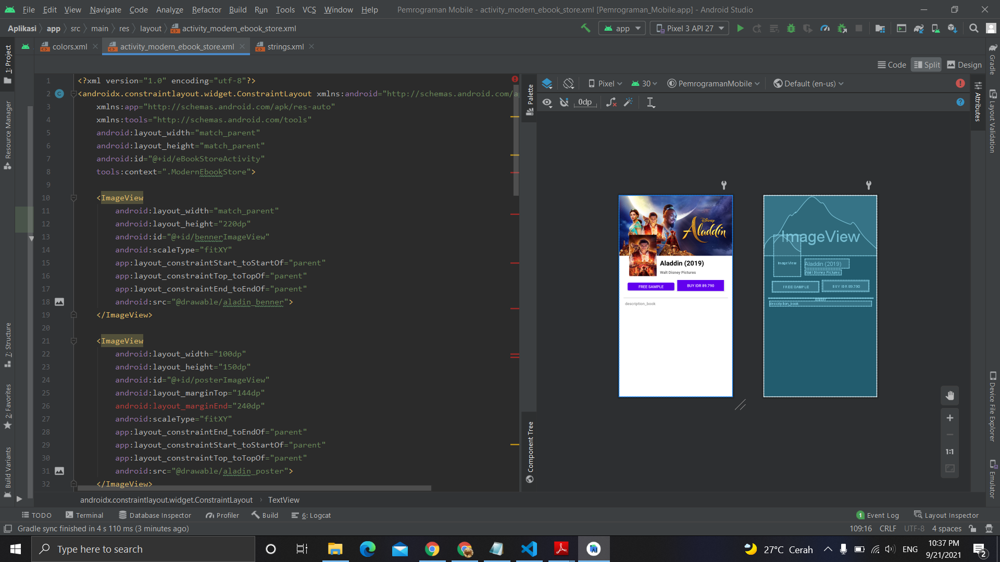

# 12 - Modern E-Book Store

## Tujuan Pembelajaran
Mahasiswa mengetahui cara membuat halaman aplikasi toko buku elektroik
modern.

## Hasil Praktikum

Berikut ini adalah hasil dari praktikum 12

[source code](../../src/02_layout&activity/app/src/main/res/layout/activity_modern_ebook_store.xml)