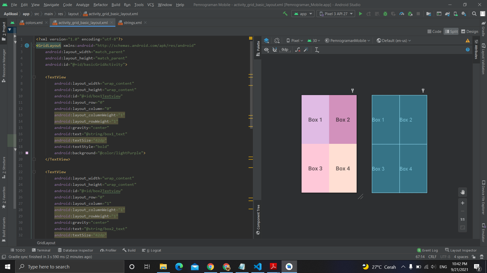

# 13 - Basic Grid layout

## Tujuan Pembelajaran
Mahasiswa mengetahui cara mengatur view pada grid layout.

## Hasil Praktikum

Berikut ini adalah hasil dari praktikum 13

[source code](../../src/02_layout&activity/app/src/main/res/layout/activity_grid_basic_layout.xml)