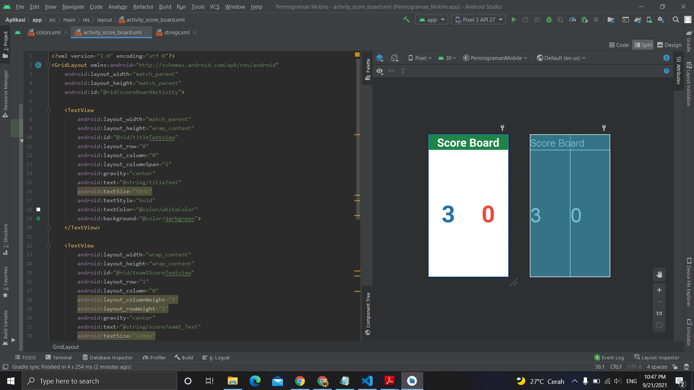

# 14 - Score Board

## Tujuan Pembelajaran
Mahasiswa mengetahui cara membuat papan skor dengan menggunakan grid
layout.

## Hasil Praktikum

Berikut ini adalah hasil dari praktikum 14

[source code](../../src/02_layout&activity/app/src/main/res/layout/activity_score_board.xml)