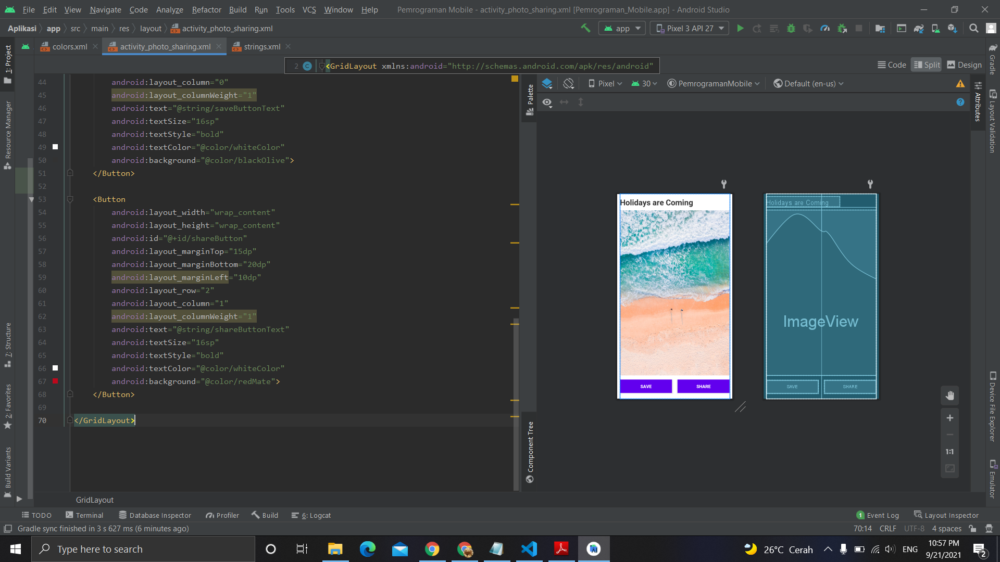

# 15 - Score Board

## Tujuan Pembelajaran
Mahasiswa mengetahui cara membuat aplikasi berbagi foto dengan
menggunakan grid layout.

## Hasil Praktikum

Berikut ini adalah hasil dari praktikum 15

[source code](../../src/02_layout&activity/app/src/main/res/layout/activity_photo_sharing.xml)